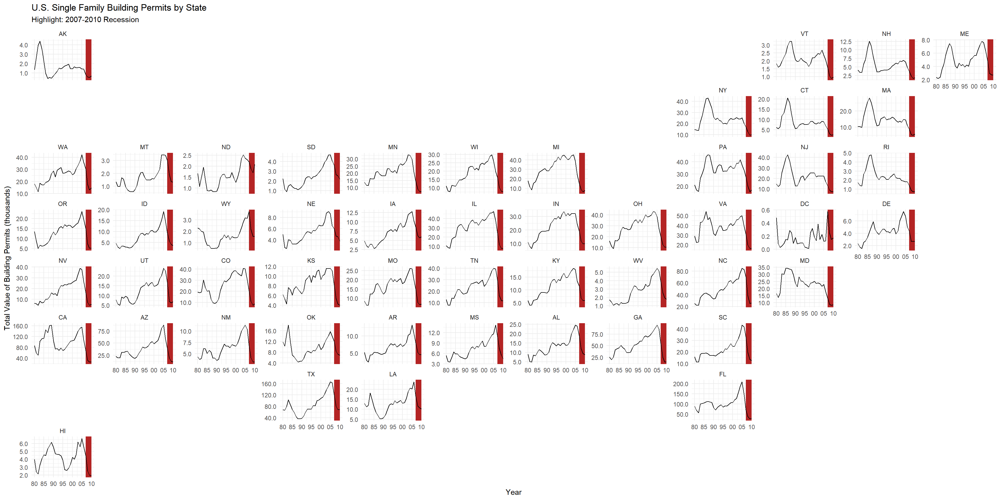
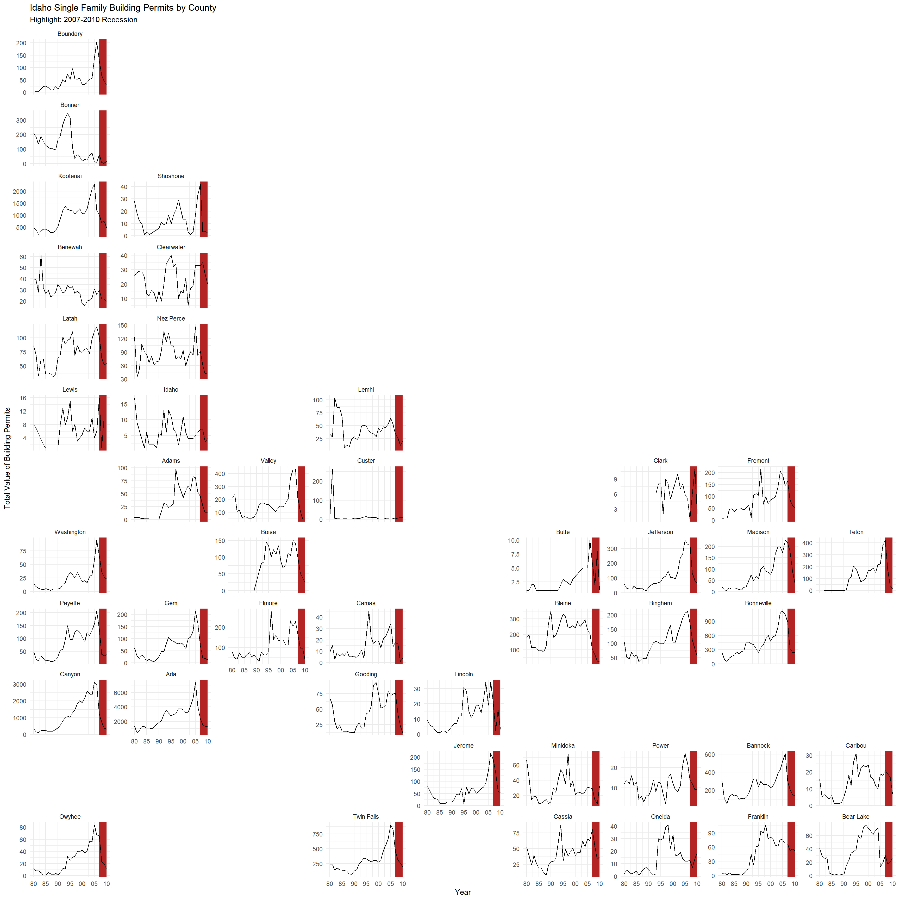

::: {.cell}

```{.r .cell-code}
if (!require("pacman")) install.packages("pacman")
pacman::p_load(tidyverse, sf, USAboundaries, scales, buildings, geofacet)
```
:::

::: {.cell}

```{.r .cell-code}
states_data <- us_states() |> 
  select(statefp, name, state_abbr, geometry)

id_counties <- us_counties(states = 'ID')

data(permits)

# data for state and county levels
permits_state <- permits |>
  filter(variable == "Single Family") |>
  group_by(StateAbbr, year) |>
  summarize(total_value = sum(value), .groups = 'drop')

permits_id <- permits |>
  filter(StateAbbr == "ID", variable == "Single Family") |>
  group_by(countyname, year) |>
  summarize(total_value = sum(value), .groups = 'drop')

state_permits <- states_data |>
  rename(StateAbbr = state_abbr) |>
  left_join(permits_state, by = "StateAbbr")

id_permits <- id_counties |>
  select(-state_name) |>
  rename(countyname = namelsad) |>
  left_join(permits_id, by = 'countyname')
```
:::

::: {.cell}

```{.r .cell-code}
ggplot(state_permits, aes(year, total_value)) +
  geom_rect(aes(xmin = 2007, xmax = 2010, ymin = -Inf, ymax = Inf),
            fill = "firebrick", alpha = 0.2) +
  geom_line() +
  facet_geo(~ StateAbbr, grid = 'us_state_grid2', scales = "free_y") +
  scale_x_continuous(breaks = seq(1980, 2010, by = 5),
                     labels = function(x) formatC(x %% 100, width = 2, flag = "0")) +
  scale_y_continuous(labels = label_number(scale = 1e-3, accuracy = 0.1)) +
  labs(x = 'Year', y = 'Total Value of Building Permits (thousands)',
       title = 'U.S. Single Family Building Permits by State',
       subtitle = 'Highlight: 2007-2010 Recession') +
  theme_minimal()
```

::: {.cell-output-display}
{width=1920}
:::
:::


The analysis combines a geometric map and a time-based plot to examine the distribution and trends of single-family building permits in the U3 from 1980 to 2010. Due to significant differences in permit numbers across states—for example, California consistently having more permits than many smaller states—the y-axis for each state is scaled independently to better illustrate the economic landscape. The data shows a general upward trend in permit numbers until around 2005, after which a notable decrease is observed, particularly highlighted during the 2007-2010 period in red to denote the impact of the Mortgage Crisis. This pattern reflects the initial rise in permit costs leading up to the Great Recession, followed by a significant fall as the recession worsened, with some states eventually showing a resurgence in permit activity post-recession, albeit slowly, as the housing market began to recover from its profound downturn.


::: {.cell}

```{.r .cell-code}
# Plot for Idaho counties
ggplot(id_permits, aes(year, total_value)) +
  geom_rect(aes(xmin = 2007, xmax = 2010, ymin = -Inf, ymax = Inf),
            fill = "firebrick", alpha = 0.2) +
  geom_line() +
  facet_geo(~ name, grid = "us_id_counties_grid1", scales = 'free_y') +
  scale_x_continuous(breaks = seq(1980, 2010, by = 5),
                     labels = function(x) formatC(x %% 100, width = 2, flag = "0")) + 
  labs(x = 'Year', y = 'Total Value of Building Permits',
       title = 'Idaho Single Family Building Permits by County',
       subtitle = 'Highlight: 2007-2010 Recession') +
  theme_minimal()
```

::: {.cell-output-display}
{width=1728}
:::
:::


In examining Idaho's landscape for single-family building permits, it's evident that economic fluctuations have markedly influenced the market, akin to broader national trends. The state showcases a diverse range of permit costs across its counties, mirroring the disparity seen in states like California where metropolitan areas vastly differ from rural locales in terms of pricing. Over the years, Idaho has experienced shifts in permit distribution, with an increasing number of permits in urban centers while rural areas have seen a decline. This pattern reflects the state’s response to economic conditions and urbanization trends, offering insight into the dynamic real estate landscape within Idaho.
