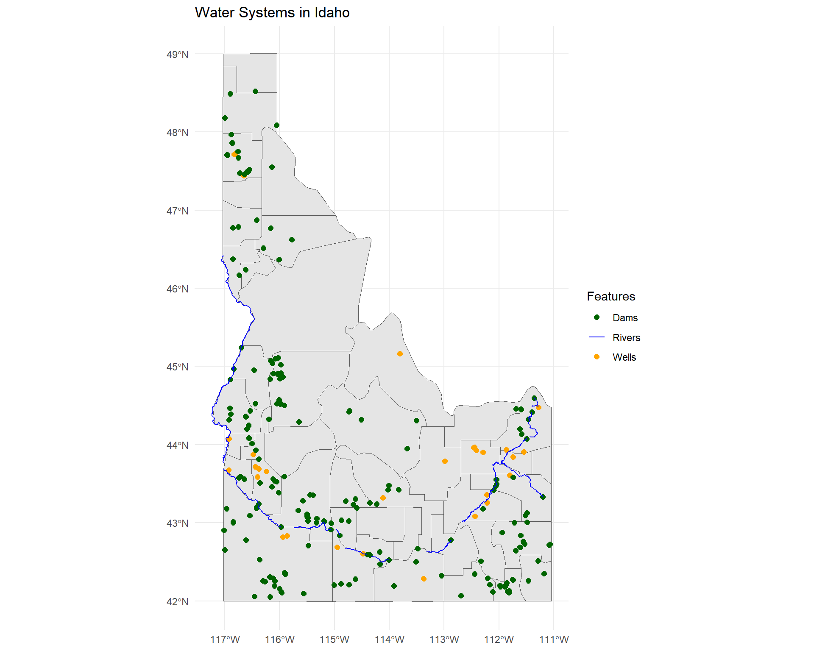

::: {.cell}

```{.r .cell-code}
if (!require("pacman")) install.packages("pacman")
pacman::p_load(tidyverse, sf)

# links to zip files
zip_dir <- "data/zip"
wells_zip <- file.path(zip_dir, "Wells.zip")
dams_zip <- file.path(zip_dir, "Idaho_Dams.zip")
water_zip <- file.path(zip_dir, "water.zip")
shp_zip <- file.path(zip_dir, "shp.zip")
unzip(wells_zip, exdir = tempdir())
unzip(dams_zip, exdir = tempdir())
unzip(water_zip, exdir = tempdir())
unzip(shp_zip, exdir = tempdir())

# Read and filter data
wells_path <- file.path(tempdir(), "Wells.shp")
dams_path <- file.path(tempdir(), "Dam_Safety.shp")
water_path <- file.path(tempdir(), "hyd250.shp")
shp_path <- file.path(tempdir(), "County-AK-HI-Moved-USA-Map.shp")

wells <- st_read(wells_path)
```

::: {.cell-output .cell-output-stdout}

```
Reading layer `Wells' from data source 
  `C:\Users\eduar\AppData\Local\Temp\Rtmp63TonN\Wells.shp' using driver `ESRI Shapefile'
Simple feature collection with 195091 features and 33 fields
Geometry type: POINT
Dimension:     XY
Bounding box:  xmin: -117.3642 ymin: 41.02696 xmax: -111.0131 ymax: 49.00021
Geodetic CRS:  WGS 84
```


:::

```{.r .cell-code}
dams <- st_read(dams_path)
```

::: {.cell-output .cell-output-stdout}

```
Reading layer `Dam_Safety' from data source 
  `C:\Users\eduar\AppData\Local\Temp\Rtmp63TonN\Dam_Safety.shp' 
  using driver `ESRI Shapefile'
Simple feature collection with 1127 features and 23 fields
Geometry type: POINT
Dimension:     XY
Bounding box:  xmin: -117.0866 ymin: 42.00058 xmax: -111.0725 ymax: 48.95203
Geodetic CRS:  WGS 84
```


:::

```{.r .cell-code}
water <- st_read(water_path)
```

::: {.cell-output .cell-output-stdout}

```
Reading layer `hyd250' from data source 
  `C:\Users\eduar\AppData\Local\Temp\Rtmp63TonN\hyd250.shp' using driver `ESRI Shapefile'
Simple feature collection with 30050 features and 26 fields
Geometry type: LINESTRING
Dimension:     XY
Bounding box:  xmin: 2241685 ymin: 1198722 xmax: 2743850 ymax: 1981814
Projected CRS: NAD83 / Idaho Transverse Mercator
```


:::

```{.r .cell-code}
state_shape <- st_read(shp_path) |> filter(StateName == "Idaho")
```

::: {.cell-output .cell-output-stdout}

```
Reading layer `County-AK-HI-Moved-USA-Map' from data source 
  `C:\Users\eduar\AppData\Local\Temp\Rtmp63TonN\County-AK-HI-Moved-USA-Map.shp' 
  using driver `ESRI Shapefile'
Simple feature collection with 3115 features and 15 fields
Geometry type: MULTIPOLYGON
Dimension:     XY
Bounding box:  xmin: -2573301 ymin: -1889441 xmax: 2256474 ymax: 1565782
Projected CRS: Albers
```


:::

```{.r .cell-code}
wells_filtered <- wells |> filter(Production > 5000)
dams_filtered <- dams |> filter(SurfaceAre > 50)
water_filtered <- water |> filter(FEAT_NAME %in% c("Snake River", "Henrys Fork"))
crs_idaho <- st_crs(4326)
state_shape <- st_transform(state_shape, crs_idaho)
wells_filtered <- st_transform(wells_filtered, crs_idaho)
dams_filtered <- st_transform(dams_filtered, crs_idaho)
water_filtered <- st_transform(water_filtered, crs_idaho)
```
:::


# Map with filtered Data

This map only includes well locations with a production of more than 5000 gallons, only shows dams with a surface area larger than 50 acres, and shows the Snake and Henry's Fork rivers.


::: {.cell}

```{.r .cell-code}
# plot map
idaho_map <- ggplot() +
  geom_sf(data = state_shape) +
  geom_sf(data = wells_filtered, aes(color = "Wells"), size = 2) +
  geom_sf(data = dams_filtered, aes(color = "Dams"), size = 2) +
  geom_sf(data = water_filtered, aes(color = "Rivers"), size = 1) +
  scale_color_manual(values = c("Wells" = "orange", "Dams" = "darkgreen", "Rivers" = "blue"), name = "Features") +
  labs(title = "Water Systems in Idaho") +
  theme_minimal()

# Save as png
ggsave("IdahoWater.png", plot = idaho_map, width = 10, height = 8)


idaho_map
```

::: {.cell-output-display}
{width=960}
:::
:::
